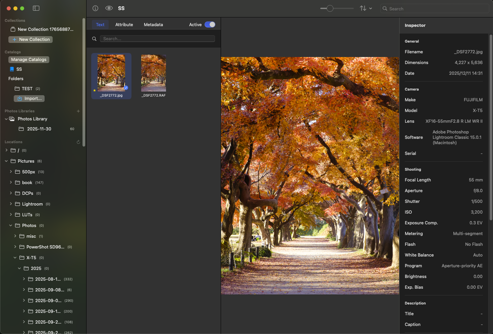

# SwiftViewer

SwiftViewer is a high-performance media viewer for macOS, designed for photographers and creative professionals. It offers fast browsing, advanced filtering, and efficient management of large image collections.



## Features

### High-Performance Browsing
- **Folders Mode**: Browse your file system directly with real-time folder monitoring.
- **Catalog Mode**: Import folders into a database-backed catalog for persistent management.
- **Photos Library Mode**: Browse Apple Photos Libraries directly, including RAW files and sidecar assets.
- **Grid View**: Resizable thumbnails (50px-300px) with lazy loading for smooth scrolling.
- **Sidebar**: Tree-based navigation with drag & drop support for folders, catalogs, and libraries.

### Advanced Filtering
- **Text Search**: Filter by filename.
- **Star Rating**: Filter by rating (0-5 stars).
- **Color Labels**: Filter by 7 color labels (Red, Orange, Yellow, Green, Blue, Purple, Gray).
- **Favorites**: Show only favorited items.
- **Flag Status**: Filter by Pick/Reject/Unflagged status.
- **Metadata Filters** (Multi-selection support):
  - **Maker**: Camera manufacturer
  - **Camera Model**: Specific camera body
  - **Lens Model**: Lens used
  - **ISO**: ISO sensitivity values
  - **Date**: Capture date
  - **File Type**: Image/video formats
  - **Shutter Speed**: Exposure time
  - **Aperture**: F-number values
  - **Focal Length**: Lens focal length

### Image Viewing
- **Wide Format Support**: RAW (CR2, NEF, RAF, ARW, DNG, etc.), JPG, PNG, HEIC, TIFF, GIF, WEBP.
- **RAW Processing**: 
  - ExifTool integration for professional RAW metadata extraction.
  - Embedded preview extraction for fast thumbnails.
  - Correct orientation handling for all file types.
- **Preview**: Large preview with zoom (pinch gesture/double-click) and pan capabilities.
- **Video Playback**: AVPlayer-based video playback with seek controls.

### File Management
- **Drag & Drop**: Move or copy files within the app or to external applications (Finder, Mail, etc.).
- **Context Menu**: Quick access to:
  - Rating (0-5 stars)
  - Color Labels (7 colors)
  - Favorite toggle
  - Flag status (Pick/Reject)
  - "Move to Trash"
  - "Show in Finder"
- **Collections**: Group images virtually without moving files.
- **Smart Filtering**: Combine multiple filter criteria for precise file selection.

### Performance Optimizations
- **Dual-Layer Caching**:
  - **Memory Cache**: NSCache for instant access to recently viewed thumbnails.
  - **Disk Cache**: Persistent thumbnail storage for fast app launches.
- **Asynchronous Processing**: Swift Concurrency (async/await, Actor) for smooth UI.
- **Lazy Loading**: Thumbnails generated only for visible grid items.
- **File System Monitoring**: Real-time detection of file changes and unmounted volumes.

## Architecture

SwiftViewer follows a clean 3-layer architecture:

### Presentation Layer
- **ViewModels**: `MainViewModel`, `CatalogViewModel`, `AdvancedCopyViewModel`
- **Views**: 11 SwiftUI components (Grid, Detail, Inspector, Sidebar, Filter, etc.)
- **MVVM Pattern**: Reactive UI updates via `@Published` properties

### Domain Layer
- **Models**: `FileItem`, `FilterCriteria`, `ExifMetadata`
- **Services**: `FileSortService`, `ThumbnailGenerationService`
- **Business Logic**: Filtering, sorting, and validation rules

### Infrastructure & Data Layer
- **CoreData**: Persistent storage for catalogs, media items, EXIF data, collections
- **Image Processing**: `ExifReader`, `ThumbnailGenerator`, `RawImageLoader`, `EmbeddedPreviewExtractor`
- **Caching**: `ThumbnailCacheService`, `ImageCacheService`
- **File System**: `FileSystemService`, `FileSystemMonitor`, `FileOperationService`
- **Logging**: Centralized `Logger` service

## Requirements

- **macOS**: 14.0 (Sonoma) or later.
- **Architecture**: Apple Silicon (M1/M2/M3) recommended.
- **ExifTool**: Required for RAW file metadata (install via Homebrew: `brew install exiftool`).

## Building the Project

This project uses Swift Package Manager.

### Build SwiftViewer (Main App)
```bash
./create_app.sh
```
This will create `SwiftViewer.app` in the project root.
To create a distributable zip file:
```bash
zip -r SwiftViewer.app.zip SwiftViewer.app
```

### Testing
To run the automated test suite:
```bash
./run_tests.sh
```

Test coverage includes:
- EXIF reading (RAW files, batch processing, orientation)
- Thumbnail generation and caching
- Repository operations
- Specification compliance
- Regression tests

## Development

- **Language**: Swift 5.9+
- **Frameworks**: SwiftUI, AppKit, Core Data, AVFoundation, MapKit, QuickLook, ImageIO
- **Architecture**: MVVM (Model-View-ViewModel)
- **Concurrency**: Swift Concurrency (async/await, Task, Actor, MainActor)
- **Package Structure**:
  - `SwiftViewerCore`: Core library (46 Swift files)
  - `SwiftViewer`: Executable target
  - `SwiftViewerTests`: Test suite (15 test files)

## License

Copyright (c) 2025. All rights reserved.

