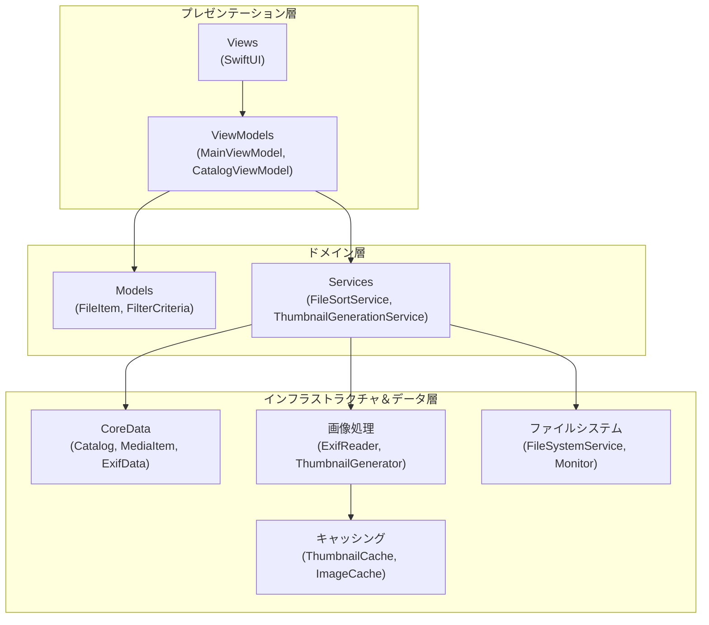
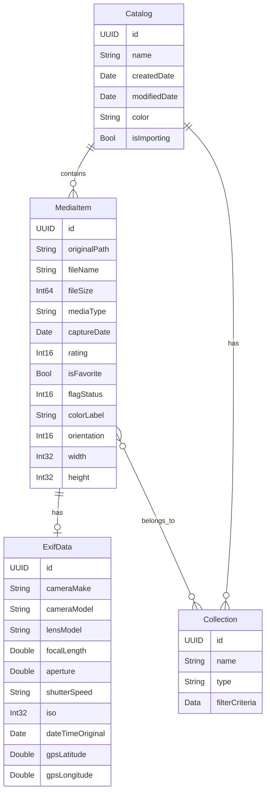
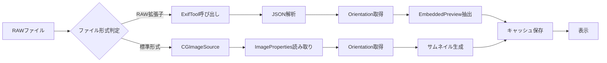

# SwiftViewer 仕様一覧

## 1. アプリケーション概要
**SwiftViewer** は、macOS向けの高速な画像・動画ビューアおよび管理アプリケーションです。Adobe Lightroom ClassicやBridgeにインスパイアされた3ペイン構成のUIを持ち、大量のメディアファイルを効率的に閲覧、整理、管理することができます。

## 2. アーキテクチャ

### 2.1 全体構成

SwiftViewerは、明確に分離された3層アーキテクチャを採用しています:



### 2.2 レイヤー詳細

#### プレゼンテーション層
- **ViewModels** (3ファイル):
  - `MainViewModel`: メインウィンドウの状態管理（4000行超）
  - `CatalogViewModel`: カタログ管理
  - `AdvancedCopyViewModel`: ファイルコピー操作
- **Views** (11コンポーネント):
  - `MainWindow`: ウィンドウレイアウト
  - `SidebarView`: フォルダ/カタログツリー
  - `GridView`: サムネイルグリッド
  - `DetailView`: 画像/動画詳細表示
  - `InspectorView`: メタデータとマップ
  - `FilterBarView`: フィルタコントロール
  - その他: `AsyncThumbnailView`, `BlockingOperationView`, `VideoPlayerView`等

#### ドメイン層
- **Models**:
  - `FileItem`: ファイル/ディレクトリの統一表現
  - `FilterCriteria`: フィルタ条件の定義
  - `ExifMetadata`: EXIF情報の構造化
- **Services**:
  - `FileSortService`: ソートロジック
  - `ThumbnailGenerationService`: サムネイル生成管理

#### インフラストラクチャ＆データ層
- **CoreData** (4エンティティ):
  - `Catalog`: カタログコンテナ
  - `MediaItem`: メディアファイル情報
  - `ExifData`: EXIF詳細データ
  - `Collection`: 仮想コレクション
- **画像処理** (7サービス):
  - `ExifReader`: 統合EXIF読み取り（ExifTool＋CGImageSource）
  - `ThumbnailGenerator`: サムネイル生成
  - `RawImageLoader`: RAW画像ローダー
  - `EmbeddedPreviewExtractor`: RAW埋め込みプレビュー抽出
  - `ExifWriter`: EXIF書き込み
  - `VideoThumbnailGenerator`: 動画サムネイル生成
  - `ImageCacheService`: 画像キャッシュ管理
- **ファイルシステム**:
  - `FileSystemService`: ファイル操作
  - `FileSystemMonitor`: 変更監視
  - `FileOperationService`: コピー/移動

## 3. データモデル

### 3.1 FileItem
```swift
public struct FileItem: Identifiable, Hashable, Sendable {
    public let url: URL
    public let isDirectory: Bool
    public let name: String
    public let isAvailable: Bool
    public var isConflict: Bool = false
    public let uuid: UUID?              // カタログアイテム用
    public var colorLabel: String?      // 7色ラベル
    public var isFavorite: Bool?        // お気に入りフラグ
    public var flagStatus: Int16?       // -1:Reject, 0:None, 1:Pick
    public let fileCount: Int?
    public let creationDate: Date?
    public let modificationDate: Date?
    public let fileSize: Int64?
    public let orientation: Int?        // EXIF Orientation
}
```

### 3.2 FilterCriteria
```swift
struct FilterCriteria: Codable {
    var minRating: Int = 0
    var colorLabel: String?
    var showImages: Bool = true
    var showVideos: Bool = true
    var searchText: String = ""
    var showOnlyFavorites: Bool = false
    var flagFilter: FlagFilter = .all
    
    enum FlagFilter: String, CaseIterable, Codable {
        case all = "All"
        case flagged = "Flagged"      // Pick または Reject
        case unflagged = "Unflagged"  // フラグなし
        case pick = "Pick"            // flagStatus == 1
        case reject = "Reject"        // flagStatus == -1
    }
    
    // メタデータフィルター（複数選択）
    var selectedMakers: Set<String> = []
    var selectedCameras: Set<String> = []
    var selectedLenses: Set<String> = []
    var selectedISOs: Set<String> = []
    var selectedDates: Set<String> = []
    var selectedFileTypes: Set<String> = []
    var selectedShutterSpeeds: Set<String> = []
    var selectedApertures: Set<String> = []
    var selectedFocalLengths: Set<String> = []
    
    // 表示列設定
    var visibleColumns: [MetadataType] = [.date, .maker, .camera, .lens, .iso]
}
```

### 3.3 CoreDataスキーマ



## 4. ユーザーインターフェース (UI)

### 4.1 レイアウト
- **3ペイン構成**:
    - **左ペイン (サイドバー)**: フォルダツリー、カタログ（コレクション）
    - **中央ペイン (グリッド/プレビュー)**: サムネイル一覧、または単一ファイルの拡大表示
    - **右ペイン (インスペクタ)**: メタデータ表示、レーティング・ラベル操作、マップ
- **リサイズ**: 各ペインの幅はドラッグで調整可能。サムネイルペインの幅はアプリ終了後も保持される（`@AppStorage`）。
- **ダークモード対応**: macOSのシステム設定に従う。

### 4.2 サイドバー
- **Locations (ファイルシステム)**:
    - マウントされたボリュームとホームディレクトリ配下のフォルダを階層表示。
    - システムアイコン（フォルダ、ディスク等）の使用。
    - **ドラッグ＆ドロップ**: フォルダへのファイル移動・コピーに対応。
    - **選択**: アイコンまたはフォルダ名をクリックして選択（青背景・白文字のハイライト）。
- **Catalog (仮想コレクション)**:
    - ユーザーが作成した任意のコレクション（アルバム）。
    - **機能**:
        - 新規作成、名前変更、削除。
        - ファイルのドラッグ＆ドロップによる追加（実体は移動せず参照のみ）。
        - 階層構造のサポート（フォルダの中にフォルダ）。
        - ドラッグによる並び替え。
    - **永続化**: Core Dataを使用して保存。

### 4.3 グリッドビュー (サムネイル一覧)
- **表示**:
    - `LazyVGrid` を使用した高速なスクロール。
    - **サムネイルサイズ変更**: ツールバーのスライダーで50px〜300pxの範囲で調整可能。
    - **情報表示**: ファイル名、レーティング（星）、カラーラベル（枠線または背景）、フラグアイコン、お気に入りアイコン。
- **操作**:
    - **選択**: クリックで単一選択、Cmd+クリックで複数選択、Shift+クリックで範囲選択。
    - **キーボード操作**: 矢印キーでの移動、Shift+矢印での範囲選択。
    - **ダブルクリック**: プレビューモード（拡大表示）への切り替え。
    - **コンテキストメニュー**:
        - Finderで表示
        - ゴミ箱に入れる
        - カタログに追加
        - レーティング・カラーラベル設定
        - お気に入り切り替え
        - フラグ設定（Pick/Reject/Unflag）
- **並び替え**:
    - 日付（作成日/撮影日）、ファイル名、ファイルサイズでの昇順・降順ソート。
- **フィルタリング**:
    - レーティング（★1以上など）
    - カラーラベル（指定した色のみ表示）
    - お気に入り（お気に入りのみ表示）
    - フラグ状態（Pick/Reject/Unflagged/Flagged/All）
    - メタデータ（9種類の属性で複数選択フィルタ）

### 4.4 プレビュービュー (詳細表示)
- **画像表示**:
    - 高解像度画像の表示。
    - **ズーム**: ピンチジェスチャまたはダブルクリックで拡大/縮小。
    - **パン**: 拡大時のドラッグ移動。
- **動画再生**:
    - `AVPlayer` を使用した動画再生。
    - 再生/一時停止、シークバー。
- **ナビゲーション**:
    - 左右キーまたはボタンで前後のファイルへ移動。
    - スペースキーでQuick Look（macOS標準）の呼び出し。

### 4.5 インスペクタ (右ペイン)
- **情報表示**:
    - ファイル名、解像度、ファイルサイズ、作成日。
    - **EXIF情報**: カメラモデル、F値、シャッタースピード、ISO感度、焦点距離など。
    - **ヒストグラム**: RGBヒストグラムの表示（実装済みだが簡易的な場合あり）。
- **編集・管理**:
    - **レーティング**: 0〜5の星を設定。
    - **カラーラベル**: 7色（なし、赤、オレンジ、黄、緑、青、紫、グレー）を設定。
    - **お気に入り**: トグルボタンでON/OFF。
    - **フラグ**: Pick（+1）/Reject（-1）/None（0）の3状態。
- **マップ**:
    - GPS情報が含まれる場合、撮影場所を地図（MapKit）上にピン表示。

## 5. 機能・ロジック

### 5.1 フラグ機能（Pick/Reject）
- **3つの状態**:
  - **None (0)**: フラグなし（デフォルト）
  - **Pick (+1)**: 選択候補としてマーク
  - **Reject (-1)**: 除外候補としてマーク
- **用途**: 写真選別ワークフロー（Lightroomスタイル）
- **フィルタリング**:
  - All: すべて表示
  - Flagged: PickまたはReject
  - Unflagged: フラグなし
  - Pick: Pick のみ
  - Reject: Reject のみ
- **永続化**: CoreDataの`flagStatus`フィールドに保存

### 5.2 お気に入り機能
- **ブール値フラグ**: `isFavorite`プロパティ（true/false）
- **用途**: 重要なファイルを素早くマーク
- **フィルタリング**: "Show Only Favorites" トグルで絞り込み
- **UI表示**: グリッド上にハートアイコン表示
- **永続化**: CoreDataの`isFavorite`フィールドに保存

### 5.3 高度なメタデータフィルタリング
- **9種類の属性**:
  1. **Maker**: カメラメーカー（Canon, Nikon, Sony等）
  2. **Camera Model**: カメラモデル（EOS R5, D850等）
  3. **Lens Model**: レンズ名
  4. **ISO**: ISO感度値
  5. **Date**: 撮影日（年-月-日フォーマット）
  6. **File Type**: ファイル形式（JPG, CR2, NEF等）
  7. **Shutter Speed**: シャッタースピード（1/1000, 1/250等）
  8. **Aperture**: 絞り値（f/2.8, f/5.6等）
  9. **Focal Length**: 焦点距離（24mm, 85mm等）
- **複数選択**: 各属性で複数の値を同時選択可能（Set-based）
- **組み合わせ**: 異なる属性のフィルタを組み合わせてAND条件で絞り込み
- **列表示設定**: `visibleColumns`で表示する属性列を制御

### 5.4 ファイル操作
- **コピー・移動**:
    - サイドバーのフォルダへのドラッグ＆ドロップで実行。
    - **同一ボリューム内**: 高速な移動（Move）。
    - **別ボリューム間**: コピー（Copy）後に元ファイルを削除（ユーザー確認あり）。
    - **進捗表示**:
        - 処理中は画面全体をブロックするオーバーレイを表示。
        - 「X個中 Y個目のアイテムをコピー中...」という詳細な進捗メッセージとプログレスバーを表示。
        - UIスレッドをブロックしないよう、バックグラウンド処理とスロットリング（更新頻度調整）を実装。
- **削除**:
    - ゴミ箱への移動（`FileManager.trashItem`）。

### 5.5 RAW画像処理パイプライン



**詳細**:
1. **RAWファイル判定**: 拡張子でRAW形式を識別（CR2, NEF, RAF, ARW, DNG等）
2. **ExifTool統合**:
   - プロフェッショナルなメタデータ抽出
   - JSON形式で結果を取得
   - バッチ処理対応（複数ファイルを一括処理）
3. **埋め込みプレビュー抽出**:
   - `EmbeddedPreviewExtractor`がRAW内の高品質JPEGプレビューを抽出
   - サムネイル生成の高速化
4. **オリエンテーション処理**:
   - EXIF Orientationを正しく解釈
   - CGImagePropertyOrientationでの回転適用
5. **フォールバック**:
   - ExifTool失敗時はCGImageSourceで処理
   - 堅牢性を確保

### 5.6 サムネイル生成とキャッシング

#### メモリキャッシュ
- **実装**: NSCache
- **用途**: アプリセッション中の高速アクセス
- **管理**: 自動的にメモリプレッシャーで削除

#### ディスクキャッシュ
- **実装**: `ThumbnailCacheService`
- **保存場所**: `~/Library/Caches/SwiftViewer/Thumbnails/`
- **キー**: ファイルパス＋修正日時のハッシュ
- **無効化トリガー**:
  - ファイル削除時
  - ファイル修正時
  - ボリュームアンマウント時
- **永続性**: アプリ再起動後も利用可能

#### 非同期処理
- **Swift Concurrency**: async/await、Task、Actor
- **並列生成**: 複数サムネイルを同時生成
- **メインスレッド保護**: @MainActorで UI更新を制御
- **遅延読み込み**: 表示範囲のみ生成

### 5.7 データ管理 (Core Data)
- **Catalog**: コレクション構造とファイル参照を保存。
- **Metadata**: レーティングやカラーラベルなどのユーザー付与情報を保存（サイドカーファイルではなくDB管理）。
- **整合性**: ファイル移動・リネーム時にCore Data上のパス情報を自動更新。

### 5.8 パフォーマンス最適化
- **遅延読み込み**: グリッド表示範囲のサムネイルのみ生成・読み込み。
- **バッチ処理**: 大量のファイル操作時のCore Data更新をバッチ化。
- **FileSystemMonitor**: 変更検知で自動的にUIを更新。
- **スロットリング**: 進捗更新の頻度を制御してUI応答性を維持。

## 6. 技術スタック
- **言語**: Swift 5.9+
- **フレームワーク**: SwiftUI, AppKit, Core Data, AVFoundation, MapKit, QuickLook, ImageIO
- **アーキテクチャ**: MVVM (Model-View-ViewModel)
- **並行処理**: Swift Concurrency (async/await, Task, Actor, MainActor)
- **外部ツール**: ExifTool (Homebrewでインストール)

## 7. テスト構成

### 7.1 テストファイル (15ファイル)
- **EXIF関連**:
  - `ExifRawTest.swift`: RAWファイルのEXIF読み取り
  - `ExifBatchTest.swift`: バッチ処理テスト
  - `ExifDebugTests.swift`: EXIF読み取りデバッグ
  - `EmbeddedOrientationTests.swift`: 埋め込みオリエンテーション
- **RAW画像**:
  - `RAFVisualTest.swift`: RAF形式の視覚テスト
  - `RAFDebugTests.swift`: RAFデバッグ
  - `RAFDebugDeepDive.swift`: RAW詳細調査
  - `RAWVerificationTests.swift`: RAW処理検証
- **サムネイル**:
  - `ThumbnailGenerationServiceTests.swift`: サムネイル生成
  - `ThumbnailCacheTests.swift`: キャッシュ機能
- **その他**:
  - `SpecificationTests.swift`: 仕様適合テスト
  - `RegressionTests.swift`: 既知バグの再発防止
  - `RotationDebugTests.swift`: 回転処理デバッグ
  - `ChaosTests.swift`: ストレステスト
  - `SwiftViewerTests.swift`: 一般的なユニットテスト

### 7.2 テストカバレッジ
- EXIF読み取り（CGImageSource、ExifTool）
- サムネイル生成とキャッシング
- オリエンテーション処理
- リポジトリ操作（CoreData）
- ファイルシステム操作

## 8. 最近の実装・改善

### 8.1 フラグ機能（Pick/Reject）の追加
- `FileItem.flagStatus`プロパティ（Int16: -1/0/1）
- `FilterCriteria.flagFilter`列挙型（All/Flagged/Unflagged/Pick/Reject）
- UI: フラグアイコン表示とコンテキストメニュー
- CoreData: `MediaItem.flagStatus`フィールド

### 8.2 お気に入り機能の追加
- `FileItem.isFavorite`プロパティ（Bool）
- `FilterCriteria.showOnlyFavorites`フィルター
- UI: ハートアイコン表示とトグルボタン
- CoreData: `MediaItem.isFavorite`フィールド

### 8.3 メタデータフィルタリングの拡張
- 9種類の属性フィルター（Maker, Camera, Lens, ISO, Date, FileType, ShutterSpeed, Aperture, FocalLength）
- Set-basedの複数選択
- 列表示設定（`visibleColumns`）
- FilterBarViewの実装

### 8.4 UI/UX改善
- カタログ/フォルダ選択: ドラッグ操作とクリック選択の競合を解消（`HStack` + `.onTapGesture`）
- プログレスバー: 正確な進捗表示とUIのレスポンス改善（スロットリング）
- 設定保存: サムネイルペインの幅を永続化（`@AppStorage`）
- 視覚フィードバック: 選択項目のハイライト（青背景・白文字）を強化
- マルチセレクション時の状態表示: お気に入り・フラグインジケーターの正確な表示
