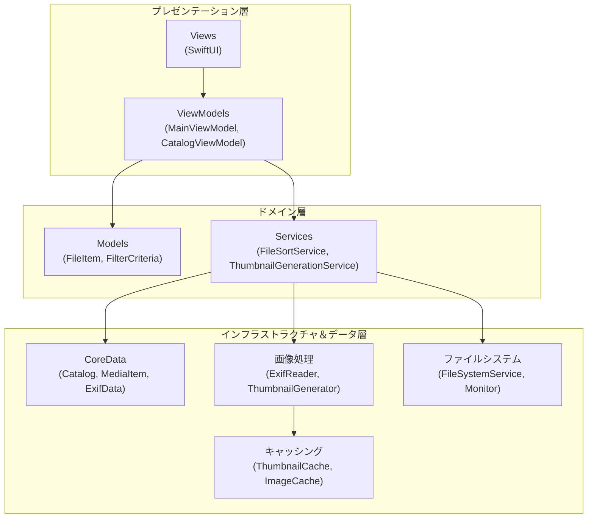
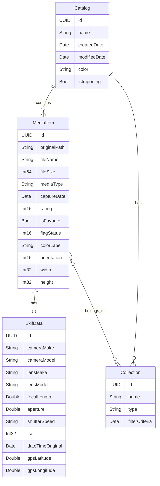
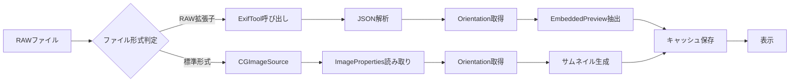

# SwiftViewer 仕様一覧

## 1. アプリケーション概要
**SwiftViewer** は、macOS向けの高速な画像・動画ビューアおよび管理アプリケーションです。Adobe Lightroom ClassicやBridgeにインスパイアされた3ペイン構成のUIを持ち、大量のメディアファイルを効率的に閲覧、整理、管理することができます。

- **現在のバージョン**: 2.66
- **最小macOSバージョン**: 13.0 (Ventura)

## 2. アーキテクチャ

### 2.1 全体構成

SwiftViewerは、明確に分離された3層アーキテクチャを採用しています:


```mermaid
graph TB
    subgraph Presentation["プレゼンテーション層"]
        Views["Views<br/>(SwiftUI)"]
        ViewModels["ViewModels<br/>(MainViewModel, CatalogViewModel)"]
    end
    
    subgraph Domain["ドメイン層"]
        Models["Models<br/>(FileItem, FilterCriteria)"]
        Services["Services<br/>(FileSortService, ThumbnailGenerationService)"]
    end
    
    subgraph Infrastructure["インフラストラクチャ＆データ層"]
        CoreData["CoreData<br/>(Catalog, MediaItem, ExifData)"]
        ImageProc["画像処理<br/>(ExifReader, ThumbnailGenerator)"]
        FileSystem["ファイルシステム<br/>(FileSystemService, Monitor)"]
        Cache["キャッシング<br/>(ThumbnailCache, ImageCache)"]
    end
    
    Views --> ViewModels
    ViewModels --> Models
    ViewModels --> Services
    Services --> CoreData
    Services --> ImageProc
    Services --> FileSystem
    ImageProc --> Cache
```

### 2.2 レイヤー詳細

#### プレゼンテーション層
- **ViewModels** (3ファイル):
  - `MainViewModel`: メインウィンドウの状態管理（4000行超）
  - `CatalogViewModel`: カタログ管理
  - `AdvancedCopyViewModel`: ファイルコピー操作
- **Views** (14コンポーネント):
  - `MainWindow`: ウィンドウレイアウトとキーボードショートカット
  - `SidebarView`: フォルダ/カタログツリー
  - `GridView`: サムネイルグリッド
  - `DetailView` / `ZoomableImageView`: 画像/動画詳細表示・ズーム
  - `InspectorView`: メタデータとマップ、レンズ情報編集
  - `FilterBarView`: フィルタコントロール
  - `SubPreviewView`: セカンダリディスプレイ向けプレビュー
  - `CatalogManagerView`: カタログ管理UI
  - その他: `AsyncThumbnailView`, `BlockingOperationView`, `VideoPlayerView`, `SimpleFolderTreeView`, `PersistentSplitView`等

#### ドメイン層
- **Models**:
  - `FileItem`: ファイル/ディレクトリの統一表現
  - `FilterCriteria`: フィルタ条件の定義
  - `ExifMetadata`: EXIF情報の構造化
- **Services**:
  - `FileSortService`: ソートロジック（シャッタースピードの数値ソート対応）
  - `ThumbnailGenerationService`: サムネイル生成管理

#### インフラストラクチャ＆データ層
- **CoreData** (4エンティティ):
  - `Catalog`: カタログコンテナ
  - `MediaItem`: メディアファイル情報
  - `ExifData`: EXIF詳細データ（レンズメーカー/モデル編集対応）
  - `Collection`: 仮想コレクション
- **画像処理** (7サービス):
  - `ExifReader`: 統合EXIF読み取り（ExifTool＋CGImageSource、XMPレーティング優先）
  - `ThumbnailGenerator`: サムネイル生成
  - `RawImageLoader`: RAW画像ローダー
  - `EmbeddedPreviewExtractor`: RAW埋め込みプレビュー抽出
  - `ExifWriter`: EXIF書き込み（レンズメーカー/モデルのExifTool経由書き込み）
  - `VideoThumbnailGenerator`: 動画サムネイル生成
  - `ImageCacheService`: 画像キャッシュ管理
- **ファイルシステム**:
  - `FileSystemService`: ファイル操作
  - `FileSystemMonitor`: 変更監視
  - `FileOperationService`: コピー/移動

## 3. データモデル

### 3.1 FileItem
```swift
public struct FileItem: Identifiable, Hashable, Sendable {
    public var id: String          // uuid.uuidString or url.path
    public let url: URL
    public let isDirectory: Bool
    public var name: String        // computed: displayName ?? url.lastPathComponent
    public let displayName: String? // Photos LibraryなどURLと異なる表示名
    public let isAvailable: Bool
    public var isConflict: Bool = false
    public var uuid: UUID?         // カタログアイテム用
    public var colorLabel: String? // 7色ラベル
    public var isFavorite: Bool?   // お気に入りフラグ
    public var flagStatus: Int16?  // -1:Reject, 0:None, 1:Pick
    public let fileCount: Int?
    public let creationDate: Date?
    public let modificationDate: Date?
    public let fileSize: Int64?
    public let orientation: Int?   // EXIF Orientation
    public var rating: Int?        // 0-5（フォルダモード用）
}
```

### 3.2 ExifMetadata
```swift
public struct ExifMetadata: @unchecked Sendable {
    public var cameraMake: String?
    public var cameraModel: String?
    public var lensMake: String?       // レンズメーカー（編集可能）
    public var lensModel: String?      // レンズモデル（編集可能）
    public var focalLength: Double?
    public var aperture: Double?
    public var shutterSpeed: String?
    public var iso: Int?
    public var dateTimeOriginal: Date?
    public var gpsLatitude: Double?
    public var gpsLongitude: Double?
    public var rating: Int?            // XMP/EXIFレーティング（XMP優先）
}
```

### 3.3 FilterCriteria
```swift
struct FilterCriteria: Codable {
    var minRating: Int = 0
    var colorLabel: String?
    var showImages: Bool = true
    var showVideos: Bool = true
    var searchText: String = ""
    var showOnlyFavorites: Bool = false
    var flagFilter: FlagFilter = .all
    
    enum FlagFilter: String, CaseIterable, Codable {
        case all = "All"
        case flagged = "Flagged"      // Pick または Reject
        case unflagged = "Unflagged"  // フラグなし
        case pick = "Pick"            // flagStatus == 1
        case reject = "Reject"        // flagStatus == -1
    }
    
    // メタデータフィルター（複数選択）
    var selectedMakers: Set<String> = []
    var selectedCameras: Set<String> = []
    var selectedLenses: Set<String> = []
    var selectedISOs: Set<String> = []
    var selectedDates: Set<String> = []
    var selectedFileTypes: Set<String> = []
    var selectedShutterSpeeds: Set<String> = []
    var selectedApertures: Set<String> = []
    var selectedFocalLengths: Set<String> = []
    
    // 表示列設定
    var visibleColumns: [MetadataType] = [.date, .maker, .camera, .lens, .iso]
}
```

### 3.4 CoreDataスキーマ


```mermaid
erDiagram
    Catalog ||--o{ MediaItem : contains
    Catalog ||--o{ Collection : has
    MediaItem ||--o| ExifData : has
    MediaItem }o--o{ Collection : belongs_to
    
    Catalog {
        UUID id
        String name
        Date createdDate
        Date modifiedDate
        String color
        Bool isImporting
    }
    
    MediaItem {
        UUID id
        String originalPath
        String fileName
        Int64 fileSize
        String mediaType
        Date captureDate
        Int16 rating
        Bool isFavorite
        Int16 flagStatus
        String colorLabel
        Int16 orientation
        Int32 width
        Int32 height
    }
    
    ExifData {
        UUID id
        String cameraMake
        String cameraModel
        String lensMake
        String lensModel
        Double focalLength
        Double aperture
        String shutterSpeed
        Int32 iso
        Date dateTimeOriginal
        Double gpsLatitude
        Double gpsLongitude
    }
    
    Collection {
        UUID id
        String name
        String type
        Data filterCriteria
    }
```

## 4. ユーザーインターフェース (UI)

### 4.1 レイアウト
- **3ペイン構成**:
    - **左ペイン (サイドバー)**: フォルダツリー、カタログ（コレクション）
    - **中央ペイン (グリッド/プレビュー)**: サムネイル一覧、または単一ファイルの拡大表示
    - **右ペイン (インスペクタ)**: メタデータ表示、レーティング・ラベル操作、マップ
- **リサイズ**: 各ペインの幅はドラッグで調整可能。サムネイルペインの幅はアプリ終了後も保持される（`@AppStorage`）。
- **ダークモード対応**: macOSのシステム設定に従う。

### 4.2 サイドバー
- **Locations (ファイルシステム)**:
    - マウントされたボリュームとホームディレクトリ配下のフォルダを階層表示。
    - システムアイコン（フォルダ、ディスク等）の使用。
    - **ドラッグ＆ドロップ**: フォルダへのファイル移動・コピーに対応。
    - **選択**: アイコンまたはフォルダ名をクリックして選択（青背景・白文字のハイライト）。
    - **コンテキストメニュー**: フォルダの名前変更・削除。
- **Catalog (仮想コレクション)**:
    - ユーザーが作成した任意のコレクション（アルバム）。
    - **機能**:
        - 新規作成、名前変更、削除。
        - ファイルのドラッグ＆ドロップによる追加（実体は移動せず参照のみ）。
        - 階層構造のサポート（フォルダの中にフォルダ）。
        - ドラッグによる並び替え。
    - **永続化**: Core Dataを使用して保存。

### 4.3 グリッドビュー (サムネイル一覧)
- **表示**:
    - `LazyVGrid` を使用した高速なスクロール。
    - **サムネイルサイズ変更**: ツールバーのスライダーで50px〜300pxの範囲で調整可能。
    - **情報表示**: ファイル名、レーティング（星）、カラーラベル（枠線または背景）、フラグアイコン、お気に入りアイコン。
    - **ズームスケール表示**: ツールバーに現在のズーム倍率（例: `100%`）を表示。
- **操作**:
    - **選択**: クリックで単一選択、Cmd+クリックで複数選択、Shift+クリックで範囲選択。
    - **キーボード操作**: 矢印キーでの移動、Shift+矢印での範囲選択。
    - **ダブルクリック**: プレビューモード（拡大表示）への切り替え。
    - **コンテキストメニュー**:
        - Finderで表示
        - ゴミ箱に入れる
        - カタログに追加
        - コレクションに追加 / コレクションから削除
        - レーティング・カラーラベル設定
        - お気に入り切り替え
        - フラグ設定（Pick/Reject/Unflag）
- **並び替え**:
    - 日付（作成日/撮影日）、ファイル名、ファイルサイズでの昇順・降順ソート。
- **フィルタリング**:
    - レーティング（★1以上など）
    - カラーラベル（指定した色のみ表示）
    - お気に入り（お気に入りのみ表示）
    - フラグ状態（Pick/Reject/Unflagged/Flagged/All）
    - メタデータ（9種類の属性で複数選択フィルタ）

### 4.4 プレビュービュー (詳細表示)
- **画像表示**:
    - 高解像度画像の表示。
    - **ズーム**: スクロールホイール・ピンチジェスチャ・ダブルクリックで拡大/縮小。
    - **パン**: 拡大時のドラッグ移動。
    - **ズーム永続化**: 画像切り替え時にズームスケールと中心位置を保持（`persistedZoomScale` / `persistedZoomCenterNormalized`）。
    - **カーソルRGB**: ホバー時に現在のカーソル位置のRGB値を表示（`cursorRGB: PixelRGB?`）。
- **動画再生**:
    - `AVPlayer` を使用した動画再生。
    - 再生/一時停止、シークバー。
- **ナビゲーション**:
    - 左右キーまたはボタンで前後のファイルへ移動。
    - スペースキーでQuick Look（macOS標準）の呼び出し。

### 4.5 インスペクタ (右ペイン)
- **情報表示**:
    - ファイル名、解像度、ファイルサイズ、作成日。
    - **EXIF情報**: カメラモデル、F値、シャッタースピード、ISO感度、焦点距離など。
    - **ヒストグラム**: RGBヒストグラムの表示。
- **編集・管理**:
    - **レーティング**: 0〜5の星を設定。
    - **カラーラベル**: 7色（なし、赤、オレンジ、黄、緑、青、紫、グレー）を設定。
    - **お気に入り**: トグルボタンでON/OFF。
    - **フラグ**: Pick（+1）/Reject（-1）/None（0）の3状態。
    - **レンズ情報編集**: カタログモードでレンズメーカーとレンズモデルをインスペクタ上で直接編集可能（ExifTool経由でEXIFに書き込み）。複数選択時は共通値があれば一括編集。
- **マップ**:
    - GPS情報が含まれる場合、撮影場所を地図（MapKit）上にピン表示。

## 5. 機能・ロジック

### 5.1 フラグ機能（Pick/Reject）
- **3つの状態**:
  - **None (0)**: フラグなし（デフォルト）
  - **Pick (+1)**: 選択候補としてマーク
  - **Reject (-1)**: 除外候補としてマーク
- **用途**: 写真選別ワークフロー（Lightroomスタイル）
- **フィルタリング**:
  - All: すべて表示
  - Flagged: PickまたはReject
  - Unflagged: フラグなし
  - Pick: Pick のみ
  - Reject: Reject のみ
- **永続化**: CoreDataの`flagStatus`フィールドに保存

### 5.2 お気に入り機能
- **ブール値フラグ**: `isFavorite`プロパティ（true/false）
- **用途**: 重要なファイルを素早くマーク
- **フィルタリング**: "Show Only Favorites" トグルで絞り込み
- **UI表示**: グリッド上にハートアイコン表示
- **永続化**: CoreDataの`isFavorite`フィールドに保存

### 5.3 高度なメタデータフィルタリング
- **9種類の属性**:
  1. **Maker**: カメラメーカー（Canon, Nikon, Sony等）
  2. **Camera Model**: カメラモデル（EOS R5, D850等）
  3. **Lens Model**: レンズ名
  4. **ISO**: ISO感度値
  5. **Date**: 撮影日（年-月-日フォーマット）
  6. **File Type**: ファイル形式（JPG, CR2, NEF等）
  7. **Shutter Speed**: シャッタースピード（1/1000, 1/250等）
  8. **Aperture**: 絞り値（f/2.8, f/5.6等）
  9. **Focal Length**: 焦点距離（24mm, 85mm等）
- **複数選択**: 各属性で複数の値を同時選択可能（Set-based）
- **組み合わせ**: 異なる属性のフィルタを組み合わせてAND条件で絞り込み
- **列表示設定**: `visibleColumns`で表示する属性列を制御

### 5.4 コレクション機能
- **目的**: カタログ内でファイルを仮想的にグループ化（実ファイルは移動しない）
- **操作**:
  - コンテキストメニュー「Add to Collection」で追加
  - コンテキストメニュー「Remove from Collection」でコレクションから削除（カタログからは削除しない）
  - 「Remove from Catalog」でカタログ自体から削除
- **永続化**: CoreDataの`Collection`エンティティと`MediaItem`の多対多リレーションで管理

### 5.5 ファイル操作
- **コピー・移動**:
    - サイドバーのフォルダへのドラッグ＆ドロップで実行。
    - **同一ボリューム内**: 高速な移動（Move）。
    - **別ボリューム間**: コピー（Copy）後に元ファイルを削除（ユーザー確認あり）。
    - **進捗表示**:
        - 処理中は画面全体をブロックするオーバーレイを表示。
        - 「X個中 Y個目のアイテムをコピー中...」という詳細な進捗メッセージとプログレスバーを表示。
        - UIスレッドをブロックしないよう、バックグラウンド処理とスロットリング（更新頻度調整）を実装。
- **削除**:
    - ゴミ箱への移動（`FileManager.trashItem`）。

### 5.6 RAW画像処理パイプライン


```mermaid
flowchart LR
    Start[RAWファイル] --> Check{ファイル形式判定}
    Check -->|RAW拡張子| ExifTool[ExifTool呼び出し]
    Check -->|標準形式| CGImage[CGImageSource]
    
    ExifTool --> Parse[JSON解析]
    Parse --> Orient1[Orientation取得]
    Orient1 --> Thumb1[EmbeddedPreview抽出]
    
    CGImage --> Props[ImageProperties読み取り]
    Props --> Orient2[Orientation取得]
    Orient2 --> Thumb2[サムネイル生成]
    
    Thumb1 --> Cache[キャッシュ保存]
    Thumb2 --> Cache
    Cache --> Display[表示]
```

**詳細**:
1. **RAWファイル判定**: 拡張子でRAW形式を識別（CR2, NEF, RAF, ARW, DNG等）
2. **ExifTool統合**:
   - プロフェッショナルなメタデータ抽出
   - JSON形式で結果を取得
   - バッチ処理対応（複数ファイルを一括処理）
3. **埋め込みプレビュー抽出**:
   - `EmbeddedPreviewExtractor`がRAW内の高品質JPEGプレビューを抽出
   - サムネイル生成の高速化
4. **オリエンテーション処理**:
   - EXIF Orientationを正しく解釈
   - CGImagePropertyOrientationでの回転適用
5. **XMPレーティング優先**:
   - XMPタグのレーティング値がExif複合タグより優先して読み取られる
6. **フォールバック**:
   - ExifTool失敗時はCGImageSourceで処理
   - 堅牢性を確保

### 5.7 サムネイル生成とキャッシング

#### メモリキャッシュ
- **実装**: NSCache
- **用途**: アプリセッション中の高速アクセス
- **管理**: 自動的にメモリプレッシャーで削除

#### ディスクキャッシュ
- **実装**: `ThumbnailCacheService`
- **保存場所**: `~/Library/Caches/SwiftViewer/Thumbnails/`
- **キー**: ファイルパス＋修正日時のハッシュ
- **無効化トリガー**:
  - ファイル削除時
  - ファイル修正時
  - ボリュームアンマウント時
- **永続性**: アプリ再起動後も利用可能

#### 非同期処理
- **Swift Concurrency**: async/await、Task、Actor
- **並列生成**: 複数サムネイルを同時生成
- **メインスレッド保護**: @MainActorで UI更新を制御
- **遅延読み込み**: 表示範囲のみ生成

### 5.8 ズーム永続化
- **対象**: `ZoomableImageView`（DetailView内）
- **保持する状態**:
  - `persistedZoomScale`: ズームスケール（1.0=等倍、nil=フィット表示）
  - `persistedZoomCenterNormalized`: 表示中心の正規化座標（0.0〜1.0）
- **タイミング**: ピンチ/スクロール/ダブルクリック等のズーム操作直後に保存
- **復元**: 別の画像に切り替えた後も同じスケール・中心で表示
- **リセット**: ズームアウトして等倍(fit)に戻した場合はnilにリセット

### 5.9 データ管理 (Core Data)
- **Catalog**: コレクション構造とファイル参照を保存。
- **Metadata**: レーティングやカラーラベルなどのユーザー付与情報を保存（サイドカーファイルではなくDB管理）。
- **整合性**: ファイル移動・リネーム時にCore Data上のパス情報を自動更新。

### 5.10 パフォーマンス最適化
- **遅延読み込み**: グリッド表示範囲のサムネイルのみ生成・読み込み。
- **バッチ処理**: 大量のファイル操作時のCore Data更新をバッチ化。
- **FileSystemMonitor**: 変更検知で自動的にUIを更新。
- **スロットリング**: 進捗更新の頻度を制御してUI応答性を維持。

## 6. キーボードショートカット

| キー | 操作 |
|------|------|
| `F` | フルスクリーン切り替え |
| `Option + F` | Sub View切り替え（マルチディスプレイ） |
| `I` | インスペクタ切り替え |
| `Space` | Quick Look |
| `Command + R` | 現在のビューをリフレッシュ |
| `Command + Shift + R` | Finderで表示 |
| `Command + Shift + K` | 高度なコピー |
| `←` / `→` | 前/次のファイル |
| `0`〜`5` | レーティング設定 |
| `L` | お気に入りトグル |
| `A` | Pick フラグ設定 |
| `X` | Reject フラグ設定 |
| `U` | フラグ解除 |
| `Esc` | フルスクリーン解除 |

## 7. 技術スタック
- **言語**: Swift 5.9+
- **フレームワーク**: SwiftUI, AppKit, Core Data, AVFoundation, MapKit, QuickLook, ImageIO
- **アーキテクチャ**: MVVM (Model-View-ViewModel)
- **並行処理**: Swift Concurrency (async/await, Task, Actor, MainActor)
- **外部ツール**: ExifTool (Homebrewでインストール)

## 8. テスト構成

### 8.1 テストファイル (35ファイル)
- **EXIF関連**:
  - `ExifRawTest.swift`: RAWファイルのEXIF読み取り
  - `ExifBatchTest.swift`: バッチ処理テスト
  - `ExifDebugTests.swift`: EXIF読み取りデバッグ
  - `EmbeddedOrientationTests.swift`: 埋め込みオリエンテーション
- **RAW画像**:
  - `RAFVisualTest.swift`: RAF形式の視覚テスト
  - `RAFDebugTests.swift`: RAFデバッグ
  - `RAFDebugDeepDive.swift`: RAW詳細調査
  - `RAWVerificationTests.swift`: RAW処理検証
  - `RawMetadataTests.swift`: RAWメタデータ検証
- **サムネイル**:
  - `ThumbnailGenerationServiceTests.swift`: サムネイル生成
  - `ThumbnailCacheTests.swift`: キャッシュ機能
  - `CachingStrategyTests.swift`: キャッシング戦略
- **フィルタ・メタデータ**:
  - `FilterCriteriaTests.swift`: フィルタ条件
  - `FilterPersistenceTests.swift`: フィルタの永続化
  - `MetadataFilteringTests.swift`: メタデータフィルタリング
  - `MetadataEditingTests.swift`: メタデータ編集
  - `MetadataEditingNonCatalogTests.swift`: 非カタログモードでの編集
  - `MetadataOverlayTests.swift`: メタデータオーバーレイ
- **機能テスト**:
  - `FavoriteFeatureTests.swift`: お気に入り機能
  - `FlagFeatureTests.swift`: フラグ機能
  - `FileItemTests.swift`: FileItemモデル
  - `ShutterSpeedSortingTests.swift`: シャッタースピードソート
- **統合テスト**:
  - `IntegrationTests.swift`: 統合テスト
  - `LibraryIntegrationTests.swift`: Photosライブラリ統合
  - `CoreDataIntegrationTests.swift`: CoreData統合
  - `CatalogCrashTests.swift`: カタログクラッシュ回帰
  - `UIConsistencyTests.swift`: UI一貫性テスト
- **その他**:
  - `SpecificationTests.swift`: 仕様適合テスト
  - `RegressionTests.swift`: 既知バグの再発防止
  - `RotationDebugTests.swift`: 回転処理デバッグ
  - `ChaosTests.swift`: ストレステスト
  - `EdgeCaseTests.swift`: エッジケーステスト
  - `PerformanceTests.swift`: パフォーマンステスト
  - `FileSystemMonitorTests.swift`: ファイルシステム監視
  - `SwiftViewerTests.swift`: 一般的なユニットテスト

### 8.2 テストカバレッジ
- EXIF読み取り（CGImageSource、ExifTool）
- サムネイル生成とキャッシング
- オリエンテーション処理
- リポジトリ操作（CoreData）
- ファイルシステム操作
- フィルタ条件と永続化
- フラグ・お気に入り機能
- メタデータフィルタリング・編集

## 9. Photos Library連携
- **マルチライブラリ対応**:
  - 複数のPhotosライブラリ（`.photoslibrary`）を追加・管理可能。
  - **永続化**: セキュリティスコープ付きブックマークを使用してライブラリへのアクセス権を維持。アプリ再起動時も自動的に再読み込み。
- **アセット表示**:
  - JPEG/HEICに加え、RAWファイルの表示に対応。
  - **RAWファイル名**: UUIDではなく、ペアとなるJPEGのオリジナルファイル名（例: `IMG_1234.ARW`）を表示。
  - **サイドカーRAW**: JPEGと同一ディレクトリにあるRAWファイルを自動検出し、アセットとして表示。
- **機能統合**:
  - **ソート**: 日付、ファイル名、ファイルサイズでの並び替えに対応。
  - **メタデータ**: レーティング、フラグ、お気に入り、カラーラベルの表示と編集が可能。
  - **フィルタリング**: フォルダモードと同様のフィルタリング機能をサポート。
  - **ヘッダ表示**: ライブラリ名と選択した日付グループ名（例: `My Library - 2023-01-01`）をヘッダに表示。
- **UI制御**:
  - **RAWメタデータ編集制限**: ライブラリモードの複数選択時、RAWファイルにはメタデータ編集バッジ（星、フラグ等）を表示しない（誤操作防止）。
  - **Refresh All**: ライブラリモード時は、カタログ全体ではなく、現在表示中のライブラリビューのメタデータのみをリフレッシュ。
- **モード判定**: `isPhotosMode`はcomputedプロパティ（AppModeとは独立した状態として管理）

## 10. アプリモード
```swift
enum AppMode {
    case folders  // ファイルシステムモード
    case catalog  // カタログモード（Photos Libraryモードも含む）
}

// Photos Library使用中かどうかはcomputedプロパティで判定
var isPhotosMode: Bool { ... }
```

## 11. 状態管理と永続化

### AppStorage（アプリ終了後も保持）
- サイドバー幅
- インスペクタ幅
- サムネイルサイズ
- フィルタ設定

### UserDefaults
- Photosライブラリリスト
- 最後に選択したカタログID
- デフォルトアプリモード

### セキュリティスコープブックマーク
- Photos Libraryへのアクセス権（アプリ再起動後も維持）
